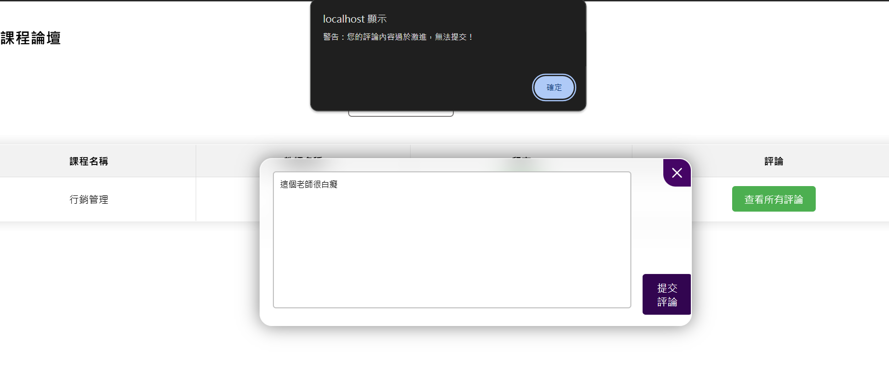
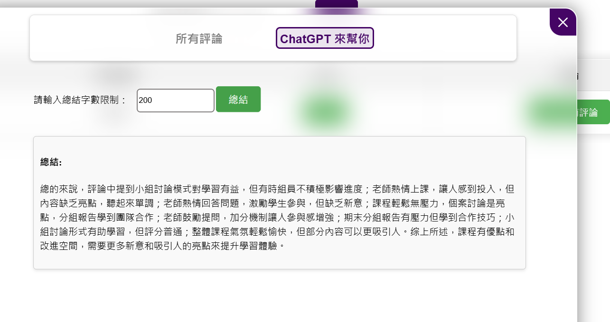

# 🎓 長庚大學 ICGU 智慧選課與成績管理平台 (AI-Powered Campus Platform)

## 🛠️ 開發環境與技術棧 (Tech Stack)

- **後端核心與邏輯**：PHP 8.x / Web API 對接
- **資料庫管理**：MySQL 8.0 (多表關聯設計、字串時間大小比對)
- **AI 整合應用**：OpenAI API (LLM 摘要控制) / Google Perspective API (語意毒性審查)
- **前端介面**：HTML5 / CSS3 / JavaScript (Vanilla JS 異步資料渲染)
- **開發工具**：Git / VS Code / DataGrip / 

## 📌 專案源起與畢業生自述
本專案為**長庚大學資訊管理學系**之畢業專題作品。

本系統旨在整合資訊技術優化校園教務生態，設計初衷聚焦於解決學生在**「學分審查」**與**「同儕課程交流」**上面臨的兩大現實痛點：

1. **教務資訊分散與決策過載（學分健檢痛點）**
   傳統校務系統介面繁複、選課與歷年學分統計分散，學生往往「無法即時、直覺地查詢畢業學分審查進度」，難以一目了然自己目前還差多少學分、差哪一類的領域才能畢業，常因資訊不透明導致選錯課甚至面臨延畢風險。

2. **缺少信任社群與言論失控風險（課程論壇痛點）**
   校園內缺乏兼具即時性與結構化的選課經驗分享媒介，學生只能在校外外部論壇盲目爬文。然而，傳統匿名論壇常因缺乏管理，導致非理性攻擊、惡意言論擴散等評論失控風險，缺乏即時風控與精準的資訊總結機制。

### 👥 團隊分工與個人核心貢獻
本專案依據團隊夥伴的技術專長進行模組化分工。全站的 Session 全局攔截、JWT 驗證及底層安全框架由專精資安防禦的隊友負責；**本人主要負責核心的「後端業務逻辑、多表資料庫設計、動態檢索演算法」以及「外部 AI 數據智能 API 模組」的研發與介接。**

這段專題經驗不僅培養了我與前端、資安夥伴對接 API 規格的團隊協作能力，更讓我體會到如何用工程思維將外部大型語言模型（LLM）務實地落地到傳統 Web 應用中。

---

## 💡 個人主導技術亮點與軟體工程實踐

### 1. 外部模型整合應用：惡意言論即時攔截機制
- **面臨痛點**：開放式課程論壇極易出現非理性謾罵或人身攻擊（如「這個老師很白癡」），導致校園社群生態惡化。
- **解決方案**：我於評論提交的後端核心邏輯中，引入 **Google Perspective API 內容審查模型** 實作文本過濾機制。在資料準備寫入 MySQL 資料庫前，將文本送往 API 進行即時語意審查。
- **實踐成果**（*詳見 toxic-speech-blocked.png*）：當使用者輸入不當言論並嘗試點擊「提交評論」時，後端經由 API 判定其有害信心值（Toxicity Score）超標，立即觸發 Early Return 攔截、切斷 SQL 寫入程序並回傳錯誤碼，由前端觸發警告彈窗，實作基礎的主動式內容過濾。

### 2. 大型語言模型應用：結構化評論智慧總結與成本控制
- **面臨痛點**：熱門課程往往累積了數百條學長姐評價，資訊高度過載，學生在選課排課時難以快速抓到重點。
- **解決方案**：介接 **OpenAI API** 實作課程評論智慧總結。透過結構化提示詞（Prompt Engineering），限制模型必須以「正方觀點（優點）」、「反方觀點（缺點與挑戰）」與「中立選課建議」三大維度進行提煉，以提升格式一致性並抑制 AI 幻覺。
- **工程思維（排版與權限控制）**（*詳見 ai-summary-demo.png*）：介面支援使用者自訂「總結字數限制」。後端接收此數值後，動態將其代入 Prompt 限制中，並同步調節 API 的 `max_tokens` 參數。這不僅優化了外部 API 呼叫的 Token 成本，也有效防範前端排版溢出的問題。

### 3. 多條件組合動態課程搜尋引擎
- **動態 SQL 拼接**：因應學生交叉篩選（開課序號、教師編號、星期等）的高度彈性需求，後端採用經典的 `WHERE 1=1` 技巧，動態拼裝 SQL 指令，自動忽略前端未填寫的空白欄位，維持代碼的高擴充性與簡潔度。
- **時段區間映射演算法**：為了解決校園非標準「課表節次（1~14節）」與資料庫實體時間的比對衝突，我利用雜湊映射（Hash Maps）建立節次與 24 小時制時間的對應關係。利用 SQL 字串大小比對特性，實作出了極具實用價值的**「空堂時段複合篩選功能」**。

### 4. 高效歷年成績查詢與防禦性網頁實踐
- **多表聯結優化 (Triple-Table JOIN)**：為避免多次單表查詢帶來的資料庫 I/O 損耗，手寫 SQL 將 **修課表 (usc)、開課表 (cur) 與 課程原始表 (sub)** 三表進行關聯查詢，在單次 Query 內即時補齊學分、必選修屬性與通識領域等元數據。
- **防禦性處理**：時序上利用 `ORDER BY` 確保歷年景觀之正確性；前端輸出則全面配合進行 HTML 實體編碼（XSS 防範防禦），並與下載腳本配合，實作歷年修課 CSV 資料檔之一鍵流暢下載。

---

### 🔒 智慧課程論壇：惡意言論即時攔截展示

### 📸 評論智能總結功能介面與實際產出

              
